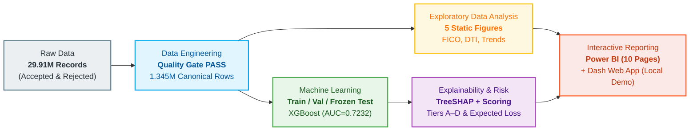
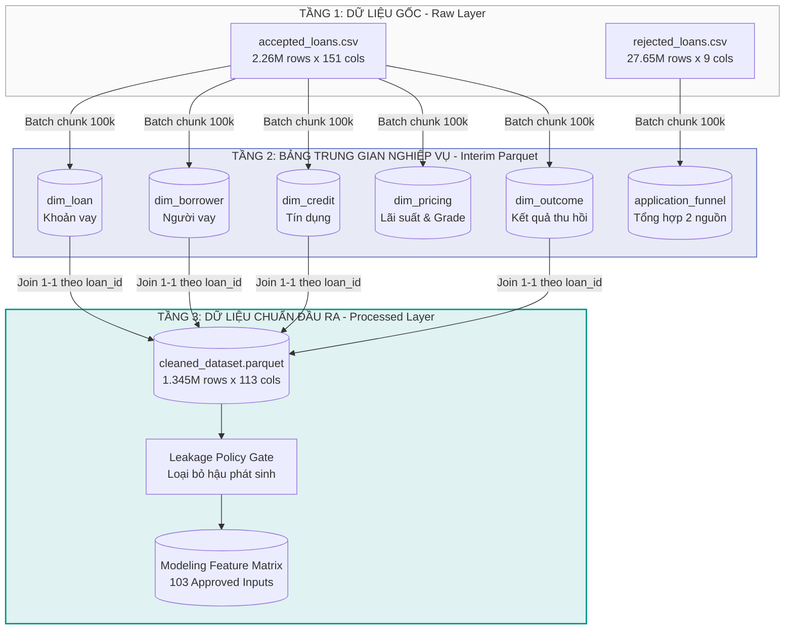
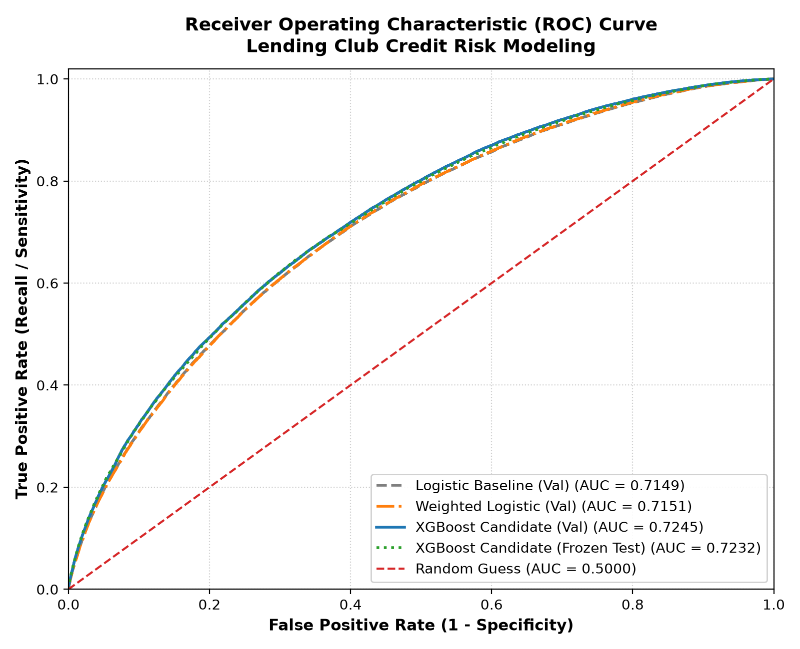
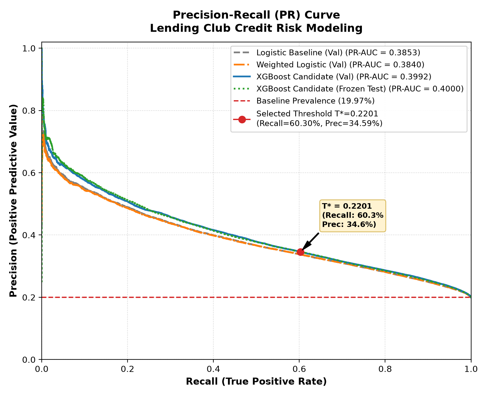
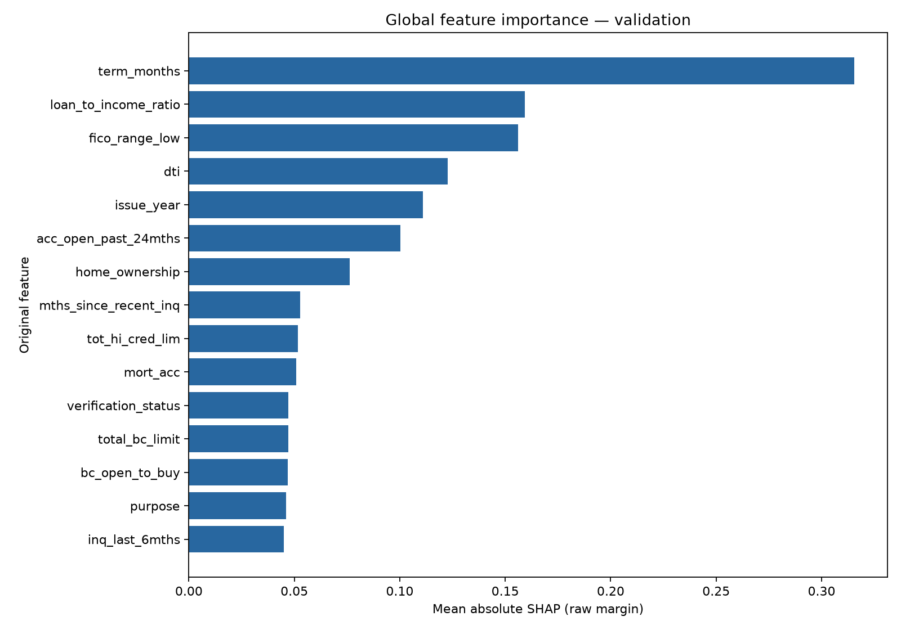
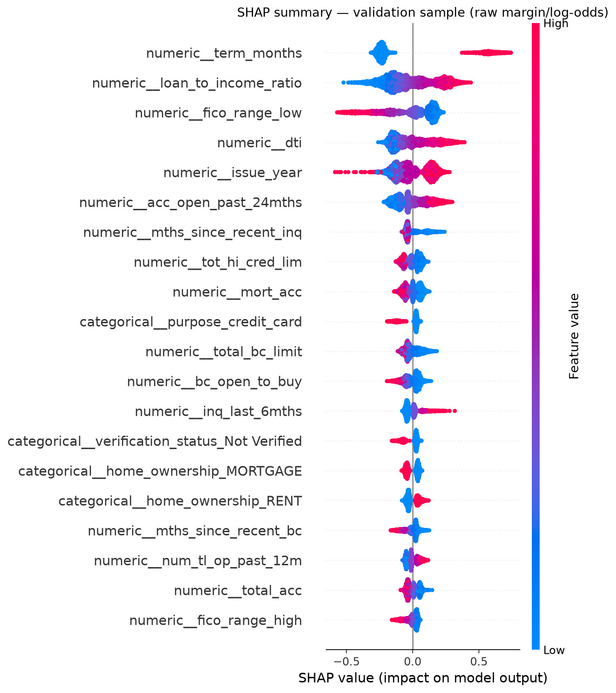
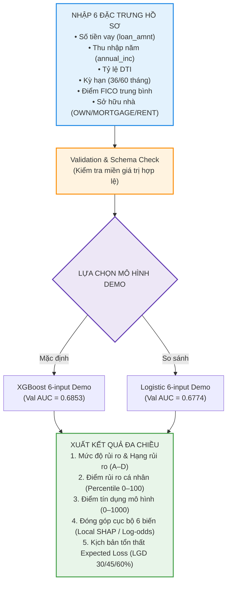

# PHÂN TÍCH RỦI RO TÍN DỤNG VÀ KHẢ NĂNG VỠ NỢ CỦA KHÁCH HÀNG CÁ NHÂN
## Credit Risk Analytics & Default Prediction (Lending Club 2007–2018)

<div align="center">

[](https://hcmute.edu.vn/)
[](reports/figures/paper/NHOM14_HO_TRONG_SON_HUYNH_TRUNG_NGHIA_HOANG_NGOC_HUY_IDV_REPORT.pdf)
[](#thành-viên-nhóm-14)

[](requirements.txt)
[-success?style=for-the-badge&logo=scikitlearn&logoColor=white)](#4-xây-dựng--đánh-giá-mô-hình-dự-báo-vỡ-nợ)
[](https://app.powerbi.com/view?r=eyJrIjoiYzlmMmM3YzAtMzE4OC00ZThjLThkMjktNzVmYTNmOTMyYzk2IiwidCI6IjM3NDE3YTJmLWYzMWEtNDZjMC05NzQyLTU0Yjg1OWY1ZmI0YyIsImMiOjEwfQ%3D%3D)
[](https://credit-risk-analytics-and-prediction.onrender.com/)

<br/>

[**Báo Cáo Đồ Án Cuối Kỳ**](reports/figures/paper/NHOM14_HO_TRONG_SON_HUYNH_TRUNG_NGHIA_HOANG_NGOC_HUY_IDV_REPORT.pdf) &nbsp;&nbsp;•&nbsp;&nbsp; [**Trực Tiếp Power BI Master Dashboard**](https://app.powerbi.com/view?r=eyJrIjoiYzlmMmM3YzAtMzE4OC00ZThjLThkMjktNzVmYTNmOTMyYzk2IiwidCI6IjM3NDE3YTJmLWYzMWEtNDZjMC05NzQyLTU0Yjg1OWY1ZmI0YyIsImMiOjEwfQ%3D%3D) &nbsp;&nbsp;•&nbsp;&nbsp; [**Trực Tiếp Web App Dự Đoán**](https://credit-risk-analytics-and-prediction.onrender.com/)

</div>

---

## THÀNH VIÊN NHÓM 14

*Học phần: Tương tác Trực quan Dữ liệu (Interactive Data Visualization) — Học kỳ I, Năm học 2026–2027*  
*Giảng viên hướng dẫn: **ThS. Đoàn Minh Trí** — Khoa Công nghệ Thông tin, Trường Đại học Công nghệ Kỹ thuật TP. Hồ Chí Minh*

| STT | Họ và Tên | MSSV | Vai Trò | Nhiệm Vụ Trọng Tâm |
|:---:|:---|:---:|:---|:---|
| 1 | **Hồ Trọng Sơn** | `24133049` | **TV2 — Data Engineering & EDA** | Thu thập, tiền xử lý dữ liệu 29.91M bản ghi, thiết kế kho dữ liệu trung gian, kiểm soát rò rỉ (Leakage Gate) và trực quan EDA tĩnh. |
| 2 | **Huỳnh Trung Nghĩa** | `24133903` | **TV1 — Modeling & Ứng Dụng** | Xây dựng pipeline học máy (Logistic, XGBoost), tối ưu ngưỡng quyết định, kiểm định Frozen Test, SHAP, Risk Tiers, Expected Loss và phát triển ứng dụng Web Plotly Dash. |
| 3 | **Hoàng Ngọc Huy** | `24133023` | **TV3 — Power BI Dashboard** | Thiết kế Data Model, DAX Measures, triển khai Master Dashboard 4 trang chính trên Power BI và đóng gói nghiệm thu. |

---

## MỤC LỤC
1. [Tổng Quan Đề Tài & Bài Toán Nghiệp Vụ](#1-tổng-quan-đề-tài--bài-toán-nghiệp-vụ)
2. [Kiến Trúc Dữ Liệu & Quy Trình Data Engineering](#2-kiến-trúc-dữ-liệu--quy-trình-data-engineering)
3. [Phân Tích Khám Phá Dữ Liệu (EDA)](#3-phân-tích-khám-phá-dữ-liệu-eda)
4. [Xây Dựng & Đánh Giá Mô Hình Dự Báo Vỡ Nợ](#4-xây-dựng--đánh-giá-mô-hình-dự-báo-vỡ-nợ)
5. [Giải Thích Mô Hình (SHAP) & Định Lượng Rủi Ro (Expected Loss)](#5-giải-thích-mô-hình-shap--định-lượng-rủi-ro-expected-loss)
6. [Hệ Thống Dashboard Power BI: Cấu Trúc 4 Trang & Câu Chuyện Dữ Liệu](#6-hệ-thống-dashboard-power-bi-cấu-trúc-4-trang--câu-chuyện-dữ-liệu)
7. [Ứng Dụng Web Dự Đoán Cá Nhân (Plotly Dash Web App)](#7-ứng-dụng-web-dự-đoán-cá-nhân-plotly-dash-web-app)
8. [Cấu Trúc Kho Lưu Trữ (Repository Structure)](#8-cấu-trúc-kho-lưu-trữ-repository-structure)
9. [Hướng Dẫn Cài Đặt & Thực Thi Mã Nguồn](#9-hướng-dẫn-cài-đặt--thực-thi-mã-nguồn)
10. [Cam Kết Liêm Chính Học Thuật & Giới Hạn Đề Tài](#10-cam-kết-liêm-chính-học-thuật--giới-hạn-đề-tài)
11. [Tài Liệu Tham Khảo](#11-tài-liệu-tham-khảo)

---

## 1. TỔNG QUAN ĐỀ TÀI & BÀI TOÁN NGHIỆP VỤ

### 1.1 Bối Cảnh Thị Trường Tín Dụng Ngang Hàng (P2P Lending)
Trong hoạt động cấp tín dụng cá nhân, việc đánh giá chính xác khả năng hoàn trả khoản vay là yếu tố then chốt quyết định sự an toàn tài chính của tổ chức cho vay. Một khoản vay có quy mô dư nợ lớn chưa chắc là khoản có rủi ro cao nhất, và phân khúc có tỷ lệ vỡ nợ cao nhất chưa chắc đóng góp phần tổn thất tài chính lớn nhất cho toàn danh mục.

Đồ án tập trung nghiên cứu toàn bộ dữ liệu lịch sử của nền tảng **Lending Club (2007–2018)** nhằm giải quyết trọn vẹn chuỗi giá trị phân tích dữ liệu:
$$\text{Data Engineering (29.9M bản ghi)} \longrightarrow \text{Machine Learning (103 features)} \longrightarrow \text{Explainable AI (SHAP)} \longrightarrow \text{Expected Loss} \longrightarrow \text{Interactive Dashboards}$$

### 1.2 Câu Hỏi Nghiên Cứu & Trọng Tâm Phân Tích
- **Phễu hồ sơ & Cơ cấu danh mục:** Quy mô hồ sơ được duyệt (Accepted) và bị từ chối (Rejected) biến động như thế nào qua các chu kỳ kinh tế?
- **Đặc trưng người vay & Mối liên hệ rủi ro:** Điểm tín dụng FICO, tỷ lệ nợ trên thu nhập (DTI), quy mô khoản vay và tình trạng nhà ở phân bố ra sao giữa nhóm trả đủ và nhóm vỡ nợ?
- **Năng lực mô hình & Đánh đổi ngưỡng phân loại:** Mô hình máy học nào tối ưu khả năng phân hạng rủi ro (ROC-AUC / PR-AUC)? Ngưỡng cắt phân loại (Decision Threshold) ảnh hưởng thế nào đến việc thu hồi khoản nợ xấu (Recall) và tỷ lệ cảnh báo nhầm (False Positive)?
- **Định lượng tổn thất danh mục:** Khi kết hợp xác suất vỡ nợ ($PD$) với quy mô dư nợ ($EAD$) và tỷ lệ tổn thất giả định ($LGD$), phân khúc nào đang nắm giữ rủi ro tài chính trọng yếu nhất?



---

## 2. KIẾN TRÚC DỮ LIỆU & QUY TRÌNH DATA ENGINEERING

### 2.1 Quy Mô Nguồn Dữ Liệu & Quy Tắc Gán Nhãn Nhị Phân
Toàn bộ dữ liệu gốc gồm 29,909,442 dòng từ hai nguồn chính thức của Lending Club (2007–2018):
- **Hồ sơ được cấp vay (Accepted Loans):** 2,260,701 dòng × 151 thuộc tính.
- **Hồ sơ bị từ chối (Rejected Applications):** 27,648,741 dòng × 9 thuộc tính.

Quy tắc gán nhãn mục tiêu ($Target$) phục vụ học có giám sát (Supervised Learning):
- **Nhãn $Y = 0$ (Không vỡ nợ - Trả đủ):** Khoản vay có trạng thái `Fully Paid` (1,076,751 khoản — chiếm 80.035%).
- **Nhãn $Y = 1$ (Vỡ nợ - Default):** Khoản vay có trạng thái `Charged Off` hoặc `Default` (268,599 khoản — chiếm 19.965%).
- **Loại trừ nghiêm ngặt:** 915,351 khoản vay chưa có kết quả cuối cùng (`Current`, `In Grace Period`, `Late 16-120 days`) và toàn bộ 27.65M hồ sơ bị từ chối (hoàn toàn không có nhãn kết quả trả nợ thực tế).
- **Tập chuẩn có nhãn (Canonical Labeled Dataset):** Gồm chính xác **1,345,350 khoản vay** với tỷ lệ vỡ nợ nền tảng là **19.965%** (mất cân bằng lớp xấp xỉ 4:1).

### 2.2 Kiến Trúc Dữ Liệu 3 Tầng & Kiểm Soát Rò Rỉ (Leakage Gate)



- **Chính sách Leakage Gate:** Loại bỏ triệt để các biến định danh (`loan_id`), biến kết quả (`target`, `loan_status`), biến phát sinh sau cấp vay (`total_pymnt`, `recoveries`, `collection_recovery_fee`), biến chính sách nội bộ (`grade`, `sub_grade`, `int_rate`) và biến địa lý chi tiết.
- **Đặc trưng đầu vào mô hình:** Sau khi lọc và chuyển hóa các cột ngày thô thành biến số tất định (`issue_year`, `issue_month`, `credit_history_months`), mô hình sử dụng chính xác **103 đặc trưng đầu vào hợp lệ** (sau khi One-Hot Encoding đạt **151 biến số ma trận**).
- **Kiểm định chất lượng (Quality Gate):** Khóa null/trùng lặp = 0; giá trị vô cực = 0; độ phủ từ điển dữ liệu = 100% ([data_quality_report.md](reports/data_quality_report.md)).

---

## 3. PHÂN TÍCH KHÁM PHÁ DỮ LIỆU (EDA)

Nhóm triển khai 5 biểu đồ tĩnh chuẩn mực bằng `matplotlib` / `seaborn`, tuân thủ nghiêm ngặt nguyên tắc trực quan hóa dữ liệu học thuật:

| Mã Hình | Nội Dung Trực Quan & Phát Hiện Chính | File Ảnh Minh Họa | Nguồn Dữ Liệu |
|:---:|:---|:---:|:---|
| **Hình 2** | **Phân bố Giá trị Khoản vay (Loan Amount Distribution):** Phân bố đa đỉnh (multimodal) tập trung mạnh ở các mốc tròn tâm lý: 10,000, 15,000, 20,000 và 35,000 đơn vị nguồn. | [eda_01_loan_amount_distribution.png](reports/figures/eda/eda_01_loan_amount_distribution.png) | Sample 200,000 dòng `cleaned_dataset` |
| **Hình 3** | **So sánh DTI theo Kết quả Khoản vay (Boxplot):** Trung vị DTI của nhóm vỡ nợ (21%) cao hơn nhóm trả đủ (18%). Tuy nhiên hai hộp chồng lấn lớn, cho thấy DTI đơn lẻ không thể phân tách rủi ro. | [eda_02_dti_by_target.png](reports/figures/eda/eda_02_dti_by_target.png) | Sample 200,000 dòng (giới hạn P99) |
| **Hình 4** | **Tỷ lệ Vỡ nợ quan sát theo Nhóm FICO (Bar Chart):** Tỷ lệ vỡ nợ giảm đơn điệu khi điểm FICO tăng: 23.6% (nhóm 650–699) $\to$ 15.7% (700–749) $\to$ 8.9% (từ 750 trở lên). | [eda_03_default_by_fico.png](reports/figures/eda/eda_03_default_by_fico.png) | Toàn bộ 1.345M khoản có nhãn |
| **Hình 5** | **Ma trận Nhiệt Rủi ro FICO × DTI (Heatmap):** Phân tích tương tác 2 chiều: Hồ sơ có FICO thấp (650–699) kết hợp DTI cao (>30%) có tỷ lệ vỡ nợ lên tới **33.1%**, cao gấp 4 lần nhóm FICO $\ge 750$ và DTI $\le 10\%$ (8.4%). | [eda_04_fico_dti_heatmap.png](reports/figures/eda/eda_04_fico_dti_heatmap.png) | Toàn bộ 1.345M khoản có nhãn |
| **Hình 6** | **Quy mô Khoản vay Accepted theo Thời gian (Time Series):** Tăng trưởng bùng nổ từ sau năm 2012, đạt đỉnh lịch sử vượt 60,000 khoản/tháng vào năm 2016 kèm các biến động lớn theo mùa vụ. | [eda_05_accepted_loan_volume_over_time.png](reports/figures/eda/eda_05_accepted_loan_volume_over_time.png) | Toàn bộ 2.26M khoản accepted |

---

## 4. XÂY DỰNG & ĐÁNH GIÁ MÔ HÌNH DỰ BÁO VỠ NỢ

### 4.1 Chiến Lược Phân Chia Dữ Liệu & Bảo Vệ Frozen Test
Quần thể 1,345,350 khoản vay được phân chia phân tầng (stratified), ngẫu nhiên có kiểm soát (`random_state=42`) thành 3 tập dữ liệu độc lập:
- **Tập huấn luyện (Train - 60%):** 807,210 dòng (161,159 nhãn 1 — 19.965%). Dùng fit preprocessing pipeline và tham số mô hình.
- **Tập kiểm định phát triển (Validation - 20%):** 269,070 dòng (53,720 nhãn 1 — 19.965%). Dùng so sánh thuật toán và tối ưu hóa ngưỡng quyết định.
- **Tập kiểm tra độc lập đóng băng (Frozen Test - 20%):** 269,070 dòng (53,720 nhãn 1 — 19.965%). Niêm phong SHA-256 (`1c48f0ef...`), chỉ mở duy nhất một lần để đo năng lực tổng quát hóa, **tuyệt đối không tham gia huấn luyện hay chọn tham số**.

### 4.2 So Sánh Mô Hình Trên Tập Validation (@ Ngưỡng tham chiếu 0.5)

| Thuật Toán Thí Nghiệm | ROC-AUC | PR-AUC | Log Loss | Brier Score | Precision | Recall | F1-Score | Accuracy | Ghi Chú Đánh Giá |
|---|---:|---:|---:|---:|---:|---:|---:|---:|---|
| **Logistic Regression (Baseline)** | 0.714887 | 0.385307 | 0.451609 | 0.144037 | 0.562454 | 0.084494 | 0.146917 | 0.804096 | Mô hình cơ sở chuẩn mực; bỏ sót 49,181 default. |
| **Weighted Logistic Regression** | 0.715097 | 0.384014 | 0.619602 | 0.215452 | 0.322134 | 0.655398 | 0.431958 | 0.655852 | Recall tăng nhưng sinh tới 74,088 cảnh báo nhầm (FP). |
| **XGBoost Classifier (Candidate)** | **0.724501** | **0.399256** | **0.447402** | **0.142595** | 0.598674 | 0.075614 | 0.134270 | 0.805326 | **Dẫn đầu toàn diện về phân hạng & chất lượng xác suất.** |

> **Quyết định khóa Candidate:** XGBoost vượt trội so với baseline ở cả ROC-AUC (+0.0096) và PR-AUC (+0.0139), đồng thời đạt Log Loss và Brier Score thấp nhất. Theo quy tắc trong [Model Contract](docs/contracts/model_contract.md), **XGBoost được khóa làm Candidate duy nhất**.

### 4.3 Tối Ưu Hóa Ngưỡng Quyết Định (Threshold Tuning trên Validation)
Tại ngưỡng mặc định 0.5, XGBoost bỏ sót tới 92.4% khoản vỡ nợ (Recall chỉ đạt 7.56%). Nhóm tiến hành tối ưu hóa ngưỡng trên 266,683 mức giá trị phân biệt của tập validation nhằm cực đại hóa chỉ số F1-Score:
- **Ngưỡng tối ưu được chọn:** $T^* = \mathbf{0.22009515762329102} \approx \mathbf{0.2201}$.
- **Hiệu quả đánh đổi:** F1 tăng mạnh từ 0.1343 lên **0.439981**; Recall thu hồi nợ xấu tăng vọt từ 7.56% lên **60.27%** (giảm số ca bỏ sót FN từ 49,658 xuống 21,344 khoản). Đổi lại, số cảnh báo nhầm (FP) tăng lên 61,074 khoản và Precision đạt 34.65%.

### 4.4 Kết Quả Kiểm Định Độc Lập Trên Frozen Test (One-shot Final Evaluation)

Đánh giá một lần trên 269,070 dòng kiểm tra đóng băng với cấu hình XGBoost và ngưỡng đã khóa $T^* = 0.2201$:

$$\begin{aligned}
\text{ROC-AUC} &= \mathbf{0.723186} \quad & \text{PR-AUC} &= \mathbf{0.400000} \quad & \text{Log Loss} &= \mathbf{0.447783} \\
\text{Precision} &= \mathbf{0.345877} \quad & \text{Recall} &= \mathbf{0.602960} \quad & \text{F1-Score} &= \mathbf{0.439590}
\end{aligned}$$

<div align="center">

| | **Mô hình Dự đoán Không Vỡ nợ (0)** | **Mô hình Dự đoán Vỡ nợ (1)** |
|:---:|:---:|:---:|
| **Thực tế Không Vỡ nợ (0)** | $\mathbf{TN = 154,092}$ | $\mathbf{FP = 61,258}$ *(Cảnh báo nhầm)* |
| **Thực tế Vỡ nợ (1)** | $\mathbf{FN = 21,329}$ *(Bỏ sót)* | $\mathbf{TP = 32,391}$ *(Phát hiện đúng)* |

</div>

<br/>

<div align="center">
  
  
  <p><em>Đồ thị thực nghiệm kiểm định độc lập: ROC Curve (trái) và Precision-Recall Curve tại T*=0.2201 (phải)</em></p>
</div>

- **Khả năng tổng quát hóa (Generalization Delta):** Độ lệch giữa Validation và Frozen Test cực kỳ nhỏ ($\Delta_{\text{ROC-AUC}} = -0.0013$; $\Delta_{\text{PR-AUC}} = +0.0007$; $\Delta_{\text{F1}} = -0.0004$). Mô hình hoàn toàn không xảy ra hiện tượng học vẹt (overfitting).
- **Phân biệt Full-Data Refit:** Mô hình thẩm định (`xgboost_candidate.joblib`) giữ nguyên kết quả trên. Sau đó, bản refit (`xgboost_full_refit.joblib`) được huấn luyện trên toàn bộ 1.345M dòng phục vụ suy luận thực tế (in-sample demo, không dùng điểm số này làm bằng chứng đánh giá).

### 4.5 Bộ Đồ Thị Đánh Giá Chuẩn Mực Tái Lập (Validation Evaluation Suite)

Để phục vụ báo cáo khoa học và bảo đảm tính minh bạch tuyệt đối, toàn bộ biểu đồ đánh giá thực nghiệm trên tập Validation được tự động sinh bằng script kiểm định độc lập [`src/models/evaluation_figures.py`](src/models/evaluation_figures.py) kết hợp bản kê chứng minh [`figures_manifest.json`](reports/figures/modeling/figures_manifest.json):

<div align="center">

| Mã Hình | Tên Đồ Thị & File Lưu Trữ | Nội Dung Trực Quan & Phương Pháp Luận |
|:---:|:---|:---|
| **FIGURE-01** | [model_roc_curve.png](reports/figures/modeling/model_roc_curve.png) | Đường cong ROC so sánh 3 mô hình (Logistic, Weighted Logistic, XGBoost) trên tập Validation; minh chứng XGBoost đạt AUC cao nhất (0.7245). |
| **FIGURE-02** | [model_precision_recall_curve.png](reports/figures/modeling/model_precision_recall_curve.png) | Đường cong Precision-Recall chuẩn Average Precision so với tỷ lệ vỡ nợ nền tảng (19.965%); khẳng định ưu thế phân loại nợ xấu của XGBoost (PR-AUC = 0.3993). |
| **FIGURE-03** | [model_confusion_matrix.png](reports/figures/modeling/model_confusion_matrix.png) | Ma trận nhầm lẫn tại ngưỡng tối ưu F1 ($T^* = 0.2201$); hiển thị cả số lượng tuyệt đối và tỷ lệ phần trăm theo hàng (TN, FP, FN, TP). |
| **FIGURE-04** | [model_calibration_curve.png](reports/figures/modeling/model_calibration_curve.png) | Biểu đồ hiệu chuẩn xác suất (10 phân vị bằng nhau, 26,907 dòng/bin); kèm chẩn đoán Log Loss (0.4474) và Brier Score (0.1426). |

</div>

<br/>

Lệnh tái lập toàn bộ 4 biểu đồ đánh giá từ xác suất Validation đã lưu:
```powershell
.\.venv\Scripts\python.exe -m src.models.evaluation_figures
```

---

## 5. GIẢI THÍCH MÔ HÌNH (SHAP) & ĐỊNH LƯỢNG RỦI RO (EXPECTED LOSS)

### 5.1 Khả Năng Giải Thích Toàn Cục Bằng TreeSHAP
Thực hiện trên mẫu phân tầng 5,000 quan sát trong không gian **log-odds (raw margin)**. Các biến mã hóa one-hot được gộp về thuộc tính gốc:

<div align="center">
  
  
  <p><em>Tầm quan trọng toàn cục SHAP (trái) và Đồ thị phân tán tóm tắt SHAP Beeswarm Plot (phải)</em></p>
</div>

1. **`term_months` (Kỳ hạn vay - $\text{Mean}\|SHAP\| = 0.3155$):** Đóng góp rủi ro áp đảo; khoản vay 60 tháng đẩy tăng log-odds rủi ro hơn nhiều so với 36 tháng.
2. **`loan_to_income_ratio` (Vay/Thu nhập - $0.1594$):** Tương quan đồng biến rất mạnh với rủi ro ($\rho = 0.982$).
3. **`fico_range_low` (Cận dưới FICO - $0.1560$):** Tương quan nghịch biến rất mạnh ($\rho = -0.973$); FICO cao kéo giảm mạnh nguy cơ vỡ nợ.
4. **`dti` (Gánh nặng nợ - $0.1228$):** Tương quan đồng biến ($\rho = 0.958$); áp lực trả nợ hiện hữu làm tăng rủi ro.
5. **Các biến tiếp theo:** `issue_year` ($0.1109$), `acc_open_past_24mths` ($0.1002$), `home_ownership` ($0.0763$), `mths_since_recent_inq` ($0.0528$), `tot_hi_cred_lim` ($0.0516$), `mort_acc` ($0.0509$).

### 5.2 Hệ Thống Chấm Điểm & Phân Tầng Rủi Ro (Risk Tiers A–D)
- **Điểm Rủi ro (Risk Score):** $\text{Risk Score} = 100 \times PD \in [0, 100]$ (càng cao càng rủi ro).
- **Điểm Tín dụng Dự án (Project Credit Score):** $\text{Credit Score} = \text{round}\big(1000 \times (1 - PD)\big) \in [0, 1000]$ (càng cao càng an toàn). *Lưu ý: Đây là thang điểm nội bộ của dự án, hoàn toàn không phải điểm FICO chính thức.*
- **Phân tầng rủi ro 4 cấp theo ngưỡng tối ưu $T^* = 0.2201$:**

| Risk Tier | Tiêu Chí Xác Định ($PD$) | Số Khoản Vay | Tỷ Trọng Danh Mục | Mean $PD$ Dự Báo | Tỷ Lệ Vỡ Nợ Thực Tế | Đánh Giá Mức Độ |
|:---:|:---|---:|---:|---:|---:|:---|
| **Tier A** | $PD < 0.11005$ | 66,275 | 24.63% | 7.73% | **6.20%** | Rủi ro rất thấp |
| **Tier B** | $0.11005 \le PD < 0.22010$ | 109,146 | 40.56% | 16.03% | **15.78%** | Rủi ro trung bình |
| **Tier C** | $0.22010 \le PD < 0.44019$ | 80,423 | 29.89% | 30.15% | **31.16%** | Rủi ro cao |
| **Tier D** | $PD \ge 0.44019$ | 13,226 | 4.92% | 51.79% | **55.41%** | Rủi ro rất cao |

### 5.3 Định Lượng Tổn Thất Kỳ Vọng (Expected Loss Analysis)
Áp dụng công thức chuẩn mực tài chính:
$$\text{Expected Loss (EL)} = PD \times LGD \times EAD$$
- $LGD$ (Loss Given Default): Giả định kịch bản cơ sở **45%** (phân tích độ nhạy tại 30% và 60%).
- $EAD$ (Exposure at Default): Đại lượng thay thế (proxy) từ số tiền vay ban đầu (`loan_amnt`, đơn vị nguồn).

**Tổng hợp danh mục Frozen Test (269,070 khoản vay — LGD = 45%):**
- **Tổng dư nợ (EAD Proxy):** **3,878,248,925** đơn vị nguồn.
- **Tổng tổn thất kỳ vọng (Total EL):** **372,579,342.19** đơn vị nguồn (Tỷ lệ EL danh mục: **9.6069%**).

<div align="center">

| Phân Tầng | Quy Mô Dư Nợ (EAD) | Tỷ Trọng Dư Nợ | Tổng Tổn Thất (EL) | Tỷ Trọng Đóng Góp EL | Mean $PD$ | EL Bình Quân / Khoản |
|:---:|---:|---:|---:|---:|---:|---:|
| **Tier A** | 884,080,425 | 22.80% | 30,589,040 | **8.21%** | 7.73% | 461.55 |
| **Tier B** | 1,447,800,500 | 37.33% | 105,104,700 | **28.21%** | 16.03% | 962.97 |
| **Tier C** | 1,295,964,450 | 33.42% | 178,417,800 | **47.89%** | 30.15% | 2,218.49 |
| **Tier D** | 250,403,550 | 6.46% | 58,467,730 | **15.69%** | 51.79% | 4,420.67 |

</div>

> **Phát hiện Quản trị Rủi ro Trọng tâm (Critical Portfolio Story):**
> Nhóm **Tier D** có xác suất vỡ nợ cá nhân cao nhất ($PD = 51.79\%$), nhưng chỉ đóng góp **15.69%** vào tổng tổn thất danh mục. Trong khi đó, **Tier C** mới là nguồn gốc rủi ro tài chính lớn nhất, đóng góp tới **47.89% tổng tổn thất kỳ vọng** (gần một nửa rủi ro danh mục). Lý do là Tier C có quy mô dư nợ tiếp xúc gấp 5.2 lần và số lượng khoản vay gấp 6.1 lần so với Tier D. Quản trị rủi ro danh mục phải tập trung kiểm soát quy mô cấp tín dụng cho phân khúc trung gian mở rộng (Tier C).

---

## 6. HỆ THỐNG DASHBOARD POWER BI: CẤU TRÚC 4 TRANG & CÂU CHUYỆN DỮ LIỆU

Nhóm triển khai hệ thống báo cáo tương tác chính thức gồm **4 trang phân tích chuyên sâu** trên nền tảng Microsoft Power BI, kết nối trực tiếp với toàn bộ chuỗi dữ liệu sạch và mô hình học máy:

<div align="center">

[](https://app.powerbi.com/view?r=eyJrIjoiYzlmMmM3YzAtMzE4OC00ZThjLThkMjktNzVmYTNmOTMyYzk2IiwidCI6IjM3NDE3YTJmLWYzMWEtNDZjMC05NzQyLTU0Yjg1OWY1ZmI0YyIsImMiOjEwfQ%3D%3D)

*Truy cập trực tiếp báo cáo tương tác tại: [Power BI Interactive Report (Nhóm 14)](https://app.powerbi.com/view?r=eyJrIjoiYzlmMmM3YzAtMzE4OC00ZThjLThkMjktNzVmYTNmOTMyYzk2IiwidCI6IjM3NDE3YTJmLWYzMWEtNDZjMC05NzQyLTU0Yjg1OWY1ZmI0YyIsImMiOjEwfQ%3D%3D)*

</div>

### 6.1 Kiến Trúc 4 Trang Phân Tích & Luồng Dữ Liệu (The 4-Page Narrative Architecture)

Hệ thống dashboard dẫn dắt người xem từ bức tranh toàn cảnh danh mục đến chi tiết rủi ro từng hồ sơ và lượng hóa tác động tài chính:

| Trang Dashboard | Mục Tiêu & Trọng Tâm Nghiệp Vụ | Bộ Dữ Liệu Nguồn | Các Chỉ Tiêu & Visual Trọng Tâm |
|:---:|:---|:---|:---|
| **Trang 1: Portfolio Overview** | Bức tranh tổng quan giải ngân, chính sách sàng lọc phễu hồ sơ và phân bố địa lý rủi ro 51 bang. | `application_funnel` (29.91M hồ sơ) & `cleaned_dataset` (1.345M có nhãn) | KPI Giải ngân (19.40 tỷ USD), FICO TB (696), Default Rate (19.97%); 100% Stacked Bar phễu hồ sơ; Filled Map rủi ro cấp bang. |
| **Trang 2: Portfolio Trends & Purpose** | Động thái chu kỳ tín dụng qua thời gian và cơ cấu mục đích sử dụng vốn của người vay. | `cleaned_dataset` & `dim_date` (2007–2018) | Biểu đồ chuỗi thời gian phân cấp (Năm $\to$ Quý $\to$ Tháng) theo dõi số lượng và nợ xấu; Biểu đồ thanh sắp xếp mục đích vay. |
| **Trang 3: Borrower Risk Profile** | Chân dung người vay, phân khúc tài chính và tương tác rủi ro đa chiều (FICO, DTI, Thu nhập). | `cleaned_dataset` & `fact_evaluated_loan` (269K Frozen Test) | Donut sở hữu nhà (Mortgage vs Rent); Heatmap tương tác FICO × DTI; Boxplot FICO × PD; Line chart Loan-to-Income × PD. |
| **Trang 4: Analysis RISK & Expected Loss** | Phân bố xác suất vỡ nợ, tầng rủi ro, giải thích SHAP và đo lường tổn thất kỳ vọng danh mục. | `fact_evaluated_loan`, `ml_lc_09_global_importance`, `ml_lc_11` | Histogram PD (20 bins); Thanh phân tầng A–D; Lollipop Top 10 SHAP; Pie chart đóng góp Expected Loss; Nút mở Web App Demo. |

### 6.2 Phân Tích Chi Tiết Từng Trang Dashboard

#### Trang 1 — Portfolio Overview (Tổng quan danh mục & Sàng lọc hồ sơ)
- **Câu hỏi nghiệp vụ:** Quy mô danh mục Lending Club ra sao, chính sách xét duyệt có khắt khe không và rủi ro phân bố theo địa lý thế nào?
- **Phát hiện dữ liệu:** 
  - Toàn bộ phễu tiếp nhận **29,909,442 hồ sơ đăng ký**. Trong đó, Lending Club **từ chối tới 92.44%** (27,648,741 hồ sơ) và chỉ phê duyệt cấp vay cho **7.56%** (2,260,701 hồ sơ). Điều này khẳng định khâu sàng lọc sơ bộ ban đầu cực kỳ khắt khe.
  - Trên tập 1,345,350 khoản vay có nhãn giải quyết xong, tổng quy mô giải ngân đạt **19.40 tỷ đơn vị tiền tệ**, điểm FICO bình quân đạt 696 và tỷ lệ vỡ nợ nền tảng quan sát là **19.97%**.
  - Rủi ro phân bố rộng khắp 51 bang Hoa Kỳ, phản ánh quy mô kinh tế và mật độ dân cư của từng địa phương.

#### Trang 2 — Portfolio Trends & Purpose (Xu hướng thời gian & Cơ cấu mục đích vay)
- **Câu hỏi nghiệp vụ:** Quy mô giải ngân và rủi ro biến động theo chu kỳ kinh tế nào? Người vay tìm đến tín dụng P2P vì mục đích gì?
- **Phát hiện dữ liệu:**
  - Hoạt động tín dụng tăng trưởng bùng nổ từ sau năm 2012 và đạt đỉnh lịch sử giải ngân vào giai đoạn 2015–2016.
  - Về mục đích vay: Hơn **75% toàn bộ danh mục** tập trung vào hai mục đích chính là **Hợp nhất nợ (Debt Consolidation)** và **Trả nợ thẻ tín dụng (Credit Card)**. Người vay tìm đến Lending Club không phải để đầu tư mạo hiểm, mà chủ yếu để tái tài trợ và giảm bớt gánh nặng lãi suất của các khoản nợ cá nhân hiện hữu.

#### Trang 3 — Borrower Risk Profile (Đặc điểm người vay & Tín hiệu rủi ro đa chiều)
- **Câu hỏi nghiệp vụ:** Đặc điểm hồ sơ nào báo hiệu rủi ro cao nhất và các biến số tài chính tương tác với nhau ra sao?
- **Phát hiện dữ liệu:**
  - **Tình trạng nhà ở:** Nhóm có tài sản thế chấp (Mortgage) chiếm 49.5%, nhóm đi thuê (Rent) chiếm 39.7%, và nhóm sở hữu hoàn toàn (Own) chiếm 10.7%.
  - **Tương tác 2 chiều FICO × DTI:** Tỷ lệ DTI đơn lẻ không thể phân tách rủi ro (hai phân phối trả đủ và vỡ nợ chồng lấn lớn). Tuy nhiên, khi kết hợp hai chiều trong Heatmap: Người vay có **FICO thấp (<700) kết hợp DTI cao (>30%) có tỷ lệ vỡ nợ thực tế lên tới 33.1%**, cao gấp gần 4 lần nhóm an toàn FICO $\ge 750$ và DTI $\le 10\%$ (8.4%).
  - **Phân bố PD theo FICO:** Boxplot chỉ ra trung vị PD giảm đơn điệu theo mức điểm FICO: từ 20.8% (nhóm 650–699) $\to$ 12.8% (700–749) $\to$ 6.8% (nhóm $\ge 750$).
  - **Tỷ lệ Khoản vay trên Thu nhập (Loan-to-Income Ratio):** Nhóm có tỷ lệ Vay/Thu nhập càng lớn thì mức PD dự đoán trung bình càng cao (tăng từ 13.68% ở ratio <0.1 lên 32.56% ở ratio $\ge 1.0$).

#### Trang 4 — Analysis RISK & Expected Loss (Phân tích rủi ro & Tổn thất kỳ vọng)
- **Câu hỏi nghiệp vụ:** Mô hình phân bổ xác suất rủi ro ra sao, đặc trưng nào chi phối quyết định và tổn thất tài chính tập trung ở đâu?
- **Phát hiện dữ liệu:**
  - **Phân bố xác suất PD (Histogram 20 bins):** Tập trung mạnh ở dải thấp–trung bình (đỉnh 10–15% PD) và có đuôi rủi ro kéo dài về phía sau.
  - **Tầng rủi ro (Risk Tiers):** Hơn 70% danh mục tập trung ở nhóm trung gian: Tier B chiếm 40.56% và Tier C chiếm 29.89%.
  - **Giải thích toàn cục SHAP:** Kỳ hạn vay (`term_months`, Mean |SHAP| = 0.3155) là yếu tố rủi ro chi phối mạnh nhất mô hình — khoản vay 60 tháng tiềm ẩn xác suất vỡ nợ vượt trội so với 36 tháng. Kế tiếp là tỷ lệ Vay/Thu nhập ($0.1594$) và điểm FICO ($0.1560$).
  - **Tích hợp ứng dụng:** Trang cung cấp nút điều hướng *"MỞ ỨNG DỤNG DỰ ĐOÁN"* giúp người dùng mở trực tiếp Web App Plotly Dash để kiểm tra ngay hồ sơ cá nhân.

---

### 6.3 Câu Chuyện Dữ Liệu Cốt Lõi & Nghịch Lý Tổn Thất Kỳ Vọng (The Expected Loss Paradox)

> [!IMPORTANT]
> **PHÁT HIỆN QUẢN TRỊ TRỌNG TÂM CỦA ĐỒ ÁN (THE CRITICAL RISK INSIGHT)**  
> Khi đánh giá rủi ro tín dụng danh mục, việc chỉ nhìn vào xác suất vỡ nợ ($PD$) sẽ dẫn đến quyết định quản trị sai lầm nghiêm trọng nếu không kết hợp với Quy mô dư nợ tiếp xúc ($EAD$) và Tổn thất kỳ vọng ($Expected\ Loss$):
> 
> 1. **Nghịch lý giữa Tỷ lệ Vỡ Nợ và Tổn Thất Tài Chính:**
>    - **Phân khúc Tier D** có xác suất vỡ nợ cá nhân cao nhất danh mục ($Mean\ PD = 51.79\%$), nhưng chỉ chiếm **6.46% tổng dư nợ** và **chỉ đóng góp 15.69% vào tổng tổn thất tài chính**.
>    - Ngược lại, **Phân khúc Tier C** có xác suất vỡ nợ ở mức trung bình ($Mean\ PD = 30.15\%$), nhưng nắm giữ tới **33.42% tổng dư nợ tiếp xúc**, và do đó **ĐÓNG GÓP TỚI 47.89% (GẦN MỘT NỬA) TỔNG TỔN THẤT KỲ VỌNG CỦA TOÀN BỘ DANH MỤC** (178.42 triệu đơn vị tổn thất tại LGD cơ sở 45%).
> 
> 2. **Ý Nghĩa Thực Tiễn Đối Với Tổ Chức Tín Dụng:**
>    - **Sai lầm truyền thống:** Bộ phận thẩm định thường dồn toàn bộ nguồn lực vào việc từ chối nhóm khách hàng rủi ro cực đoan (Tier D).
>    - **Chiến lược đúng đắn:** An toàn vốn của tổ chức cho vay thực tế lại bị đe dọa nhiều nhất bởi **phân khúc trung gian mở rộng (Tier C)**. Nhà quản trị bắt buộc phải thiết lập chính sách kiểm soát trần hạn mức cấp tín dụng, đồng thời áp dụng cơ chế định giá lãi suất theo rủi ro (Risk-based Pricing) khắt khe cho Tier C để bù đắp 48% tổn thất kỳ vọng tiềm ẩn.

---

## 7. ỨNG DỤNG WEB DỰ ĐOÁN CÁ NHÂN (PLOTLY DASH WEB APP)

Song song với Power BI Dashboard phân tích danh mục vĩ mô, nhóm phát triển ứng dụng Web tương tác độc lập phục vụ thẩm định vi mô theo thời gian thực:

<div align="center">

[](https://credit-risk-analytics-and-prediction.onrender.com/)

*Trải nghiệm trực tuyến tại: [Credit Risk Prediction App (Render Live)](https://credit-risk-analytics-and-prediction.onrender.com/)*

</div>



- **Mục tiêu ứng dụng:** Cho phép chuyên viên tín dụng nhập nhanh 6 thông số trực quan của khách hàng, so sánh tức thì giữa hai mô hình (XGBoost vs Logistic), quan sát giải thích cục bộ Local SHAP cho từng quyết định và dự phóng mức tổn thất Expected Loss theo 3 kịch bản LGD (30%, 45%, 60%).
- **Đóng gói Cloud Tự Vận Hành (Render Web Service):** Ứng dụng được thiết kế hoàn toàn khép kín tại [`apps/individual_prediction_dash/`](apps/individual_prediction_dash/) với gói artifacts chỉ **11.5 MB** (không cần nạp 29.9M dòng dữ liệu thô), vận hành trên môi trường Render Free (Python 3.12, 1 worker Gunicorn, 4 threads) ổn định dưới ngưỡng 512 MB RAM ([`DEPLOY_RENDER.md`](apps/individual_prediction_dash/DEPLOY_RENDER.md)).

---

## 8. CẤU TRÚC KHO LƯU TRỮ (REPOSITORY STRUCTURE)

```text
ttdltq/
├── README.md                           # Hồ sơ tổng quan toàn diện của đồ án
├── requirements.txt                    # Thư viện phụ thuộc nghiên cứu & huấn luyện (Python 3.10+)
├── pytest.ini                          # Cấu hình kiểm thử tự động
├── run_prediction_app.bat              # Script 1-click khởi chạy ứng dụng Plotly Dash
├── tv1_modeling_final_report_bundle.zip# Gói nén toàn bộ bằng chứng & số liệu Chương 3-4
│
├── apps/                               # Ứng dụng tương tác người dùng cuối
│   └── individual_prediction_dash/     # Web App Plotly Dash demo dự đoán cá nhân 6 biến
│       ├── app.py                      # Mã nguồn giao diện Dash UI & Callbacks
│       ├── logic.py                    # Logic suy luận, tính Percentile, Local SHAP & EL
│       ├── DEPLOY_RENDER.md            # Hướng dẫn chi tiết triển khai Render Web Service
│       ├── requirements-deploy.txt     # Phụ thuộc tinh gọn phục vụ Render Cloud
│       ├── data/                       # Artifacts runtime demo 6 biến (11.5 MB, tracked Git)
│       ├── src/                        # Package mirror phục vụ runtime Render độc lập
│       └── README.md                   # Hướng dẫn chi tiết vận hành ứng dụng
│
├── data/                               # Dữ liệu phân tích (Lưu trữ cục bộ, không Git track)
│   ├── raw/                            # accepted_loans.csv (2.26M) & rejected_loans.csv (27.65M)
│   ├── interim/                        # Các bảng nghiệp vụ Parquet (dim_loan, dim_borrower...)
│   └── processed/                      # cleaned_dataset.parquet (1.345M có nhãn)
│       └── modeling/                   # Models (.joblib), Manifests (.json) & Predictions
│
├── docs/                               # Hồ sơ quản trị & Hợp đồng kỹ thuật
│   ├── contracts/                      # data_contract.md & model_contract.md
│   ├── overview/                       # Barem-TTDLTQ.docx & overview-du-an.pdf
│   ├── setup/                          # Hướng dẫn môi trường riêng cho TV1, TV2, TV3
│   └── tasks/                          # Phân công nhiệm vụ, protocol và visual plan
│
├── logs/                               # Nhật ký thực thi nhiệm vụ minh bạch của 3 thành viên
│   ├── log_tv1.md                      # Log nghiên cứu mô hình hóa, thực nghiệm ML-LC-01 -> 13
│   ├── log_tv2.md                      # Log Data Engineering, làm sạch & EDA
│   └── log_tv3.md                      # Log thiết kế Power BI & tích hợp
│
├── reports/                            # Báo cáo thực nghiệm & Hình ảnh học thuật
│   ├── data_quality_report.md          # Báo cáo chất lượng dữ liệu & Leakage Gate PASS
│   ├── eda_report.md                   # Báo cáo phân tích khám phá dữ liệu
│   ├── tv1_stages/                     # Báo cáo 13 giai đoạn modeling & modeling_summary.md
│   ├── model_experiments/              # Báo cáo thực nghiệm mở rộng & pilot F1 cải tiến
│   │   └── f1_improvement/             # Nghiên cứu pilot F1 (protocol, logs, chẩn đoán)
│   └── figures/                        # Toàn bộ hình ảnh phục vụ báo cáo chính thức
│       ├── paper/                      # Báo cáo cuối kỳ bản PDF chính thức (85 trang)
│       ├── eda/                        # 5 biểu đồ EDA tĩnh (Hình 2 - Hình 6)
│       ├── modeling/                   # 4 biểu đồ đánh giá chuẩn mực, SHAP Global & Summary
│       │   ├── model_roc_curve.png     # FIGURE-01: ROC Curves so sánh 3 mô hình
│       │   ├── model_precision_recall_curve.png # FIGURE-02: PR Curves chuẩn AP
│       │   ├── model_confusion_matrix.png # FIGURE-03: Confusion Matrix tại T*=0.2201
│       │   ├── model_calibration_curve.png # FIGURE-04: Hiệu chuẩn xác suất 10 bins
│       │   ├── figures_manifest.json   # Bản kê kiểm định và provenance của đồ thị
│       │   └── README.md               # Đặc tả tái lập đồ thị đánh giá
│       └── dashboard/                  # Hướng dẫn thao tác và tài liệu Power BI Dashboard
│
├── src/                                # Toàn bộ mã nguồn Python tái lập
│   ├── data/                           # Ingestion, cleaning pipeline & quality checks
│   ├── features/                       # Kỹ thuật tạo 10 trường tính toán
│   └── models/                         # Pipeline học máy, đánh giá, scoring, SHAP & EL
│       ├── evaluation_figures.py       # Tự động hóa sinh 4 đồ thị đánh giá thực nghiệm
│       └── experiments/                # Khung thử nghiệm mở rộng & giám sát pilot F1
│
└── tests/                              # Hệ thống 299 unit, integration & regression tests
    ├── apps/                           # Kiểm thử ứng dụng Dash, Percentile & Render Bundle
    ├── data/                           # Kiểm thử Data Engineering & Leakage Gate
    └── models/                         # Kiểm thử Preprocessing, Evaluation Figures, SHAP & EL
```

---

## 9. HƯỚNG DẪN CÀI ĐẶT & THỰC THI MÃ NGUỒN

### 9.1 Thiết Lập Môi Trường Ảo
Yêu cầu máy tính cài đặt sẵn **Python 3.10+** và **Power BI Desktop** (khuyến nghị bản 2024 trở lên):

```powershell
# 1. Khởi tạo môi trường ảo Python
python -m venv .venv

# 2. Kích hoạt môi trường ảo (Windows PowerShell)
.\.venv\Scripts\Activate.ps1

# 3. Nâng cấp pip và cài đặt toàn bộ thư viện phụ thuộc
python -m pip install --upgrade pip
pip install -r requirements.txt
```

### 9.2 Chạy Toàn Bộ Hệ Thống Kiểm Thử Tự Động (Regression Test Suite)
Đảm bảo toàn bộ 299 kịch bản kiểm thử vượt qua thành công:

```powershell
pytest tests -v
```

### 9.3 Khởi Chạy Ứng Dụng Demo Dự Đoán Cá Nhân (Plotly Dash Cục Bộ)
Chạy script tự động hóa khởi chạy Web App tại cổng `8050`:

```powershell
.\run_prediction_app.bat
```
Hoặc khởi chạy trực tiếp thông qua Python:
```powershell
.\.venv\Scripts\python.exe -m apps.individual_prediction_dash.app
```
Truy cập trình duyệt tại địa chỉ: `http://127.0.0.1:8050` để thao tác nhập hồ sơ, so sánh XGBoost vs Logistic và quan sát đóng góp cục bộ SHAP.

### 9.4 Trải Nghiệm & Tương Tác Với Power BI Dashboard
1. Truy cập trực tiếp qua dịch vụ đám mây [Power BI Service Live](https://app.powerbi.com/view?r=eyJrIjoiYzlmMmM3YzAtMzE4OC00ZThjLThkMjktNzVmYTNmOTMyYzk2IiwidCI6IjM3NDE3YTJmLWYzMWEtNDZjMC05NzQyLTU0Yjg1OWY1ZmI0YyIsImMiOjEwfQ%3D%3D) để tương tác đầy đủ các tính năng không cần cài đặt phần mềm.
2. Sử dụng các Slicer (Bộ lọc Năm, Kỳ hạn, Mục đích vay, Hạng rủi ro) để trải nghiệm tính năng Drill-down và Cross-filtering trên 4 trang phân tích chính.

### 9.5 Triển Khai Ứng Dụng Web Lên Nền Tảng Đám Mây (Render Web Service)
Ứng dụng Dash hỗ trợ triển khai trực tiếp từ GitHub lên Render mà không cần nạp bộ dữ liệu lớn:
1. **Thiết lập dịch vụ Web Service trên Render:**
   - **Root Directory:** `apps/individual_prediction_dash`
   - **Runtime:** Python (phiên bản `3.12.10`)
   - **Build Command:** `pip install -r requirements-deploy.txt`
   - **Start Command:** `gunicorn app:server --bind 0.0.0.0:$PORT --workers 1 --threads 4 --timeout 120`
   - **Environment Variables:** `PYTHON_VERSION=3.12.10`
2. **Kiểm tra tính tương thích bundle trước khi kết nối GitHub:**
   ```powershell
   python -m pytest tests/apps/test_render_bundle.py tests/apps/test_individual_prediction_dash.py -v
   ```
Chi tiết cấu hình và tối ưu hóa tài nguyên xem tại [`DEPLOY_RENDER.md`](apps/individual_prediction_dash/DEPLOY_RENDER.md).

---

## 10. CAM KẾT LIÊM CHÍNH HỌC THUẬT & GIỚI HẠN ĐỀ TÀI

### 10.1 Cam Kết Liêm Chính Học Thuật (Academic Integrity)
- Toàn bộ kết quả thực nghiệm trong đồ án được nhóm sinh viên xây dựng từ mã nguồn gốc, có bản kê định danh (manifest) và mã băm SHA-256 bảo vệ toàn vẹn.
- Báo cáo phân biệt rạch ròi giữa số liệu đánh giá độc lập trên **Frozen Test** của mô hình ứng viên và kết quả suy luận thử nghiệm trên ứng dụng demo. Không gian lận dữ liệu hay báo cáo kết quả in-sample thay thế cho khả năng tổng quát hóa.

### 10.2 Giới Hạn Của Đề Tài
1. **Dữ liệu lịch sử quan sát:** Dữ liệu phản ánh hành vi tín dụng tại thị trường Hoa Kỳ giai đoạn 2007–2018; không đại diện cho điều kiện kinh tế hiện tại hoặc thị trường tín dụng tại Việt Nam.
2. **Quan hệ tương quan $\neq$ Nhân quả:** Các giải thích từ SHAP hay EDA chỉ mô tả liên hệ thống kê giữa đặc trưng đầu vào và dự báo của mô hình trên mẫu quan sát, không chứng minh can thiệp đặc trưng sẽ trực tiếp thay đổi khả năng trả nợ của người vay.
3. **Giả định tổn thất:** $LGD$ (45%) là giả định minh họa cho phân tích kịch bản; $loan\_amnt$ là đại lượng thay thế ($EAD\ proxy$), chưa mô hình hóa lịch thanh toán thực tế và chiết khấu dòng tiền. Expected Loss ở đây là tổn thất kỳ vọng thống kê, không phải số tiền lỗ thực tế (realized loss).
4. **Phạm vi ứng dụng:** Mô hình được thiết kế nhằm mục đích nghiên cứu học thuật và minh họa phương pháp luận trực quan hóa dữ liệu, không phải là hệ thống phê duyệt tín dụng tự động thương mại.

---

## 11. TÀI LIỆU THAM KHẢO

1. **Basel Committee on Banking Supervision**, *"Principles for the Management of Credit Risk,"* Bank for International Settlements (BIS), Sep. 2000.
2. **Basel Committee on Banking Supervision**, *"IRB approach: treatment of expected losses and provisions,"* Basel Framework, CRE35, BIS.
3. **T. Chen and C. Guestrin**, *"XGBoost: A Scalable Tree Boosting System,"* in *Proc. 22nd ACM SIGKDD Int. Conf. Knowledge Discovery and Data Mining*, 2016, pp. 785–794. [arXiv:1603.02754](https://arxiv.org/abs/1603.02754)
4. **S. M. Lundberg and S.-I. Lee**, *"A Unified Approach to Interpreting Model Predictions,"* in *Advances in Neural Information Processing Systems (NeurIPS 30)*, 2017.
5. **N. George (wordsforthewise)**, *"All Lending Club loan data (2007–2018),"* Kaggle Dataset, 2019. [Kaggle Source](https://www.kaggle.com/datasets/wordsforthewise/lending-club)
6. **Fair Isaac Corporation (FICO)**, *"What is a FICO Score and why is it important?,"* myFICO Educational Guidelines.
7. **J. Steele and N. Iliinsky (Eds.)**, *Beautiful Visualization: Looking at Data through the Eyes of Experts*, O'Reilly Media, 2010.
8. **Scikit-learn Developers**, *"Metrics and scoring: quantifying the quality of predictions,"* Scikit-learn User Guide.
9. **Microsoft Learn**, *"Overview of visualizations and model relationships in Power BI Desktop,"* Microsoft Documentation.
